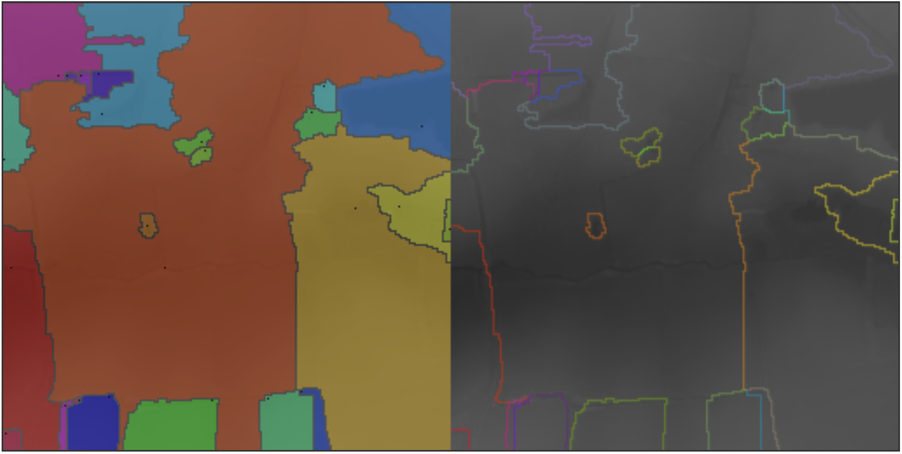

# JaWs Javascript Watershed

A rough approximation of how water ~~flows, permeates, and~~ collects across a landscape.

## Developing / evaluating

Install the node dependencies:

    pnpm install

Build the code:

    npm run build:watch

Run the tests:

    npm run test:watch

Open the example:

    python3 -m http.server

Then navigate to [http://localhost:8000/examples/index.html](http://localhost:8000/examples/index.html) to see the [examples/demo_screenshot_1.png](./examples/demo_screenshot_1.png). This the watershed segmentation of a digital terrain LIDAR map shown on the right, with the watershed segmentation areas outlined.  And on the left with the watershed areas coloured in and the minimum point of each area marked with a small black square.

Other examples are shown in the examples directory and can be re-generated from the script in src/examples.ts.
